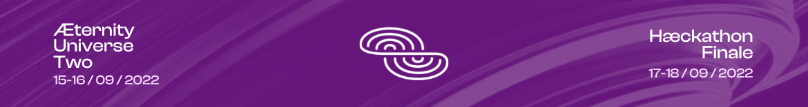

# Sign up now!
The Hæckathon is hosted via DevPost and you can sign up here:
- https://universe-two-haeckathon.devpost.com

If your team or somebody of your team wants to join the Hæckathon Finale on-site at the [CryptoCastle](https://www.cryptocastle.org) let us know as soon as possible and sign up with this form:
- http://eepurl.com/h802sT (*open until **04.09.2022***)

# Timeline

## General

| Date | Title | Details |
|---|---|---|
| 01.08.2022 | **Start of the Hæckathon** | Sign up, join the community, find a team, generate an idea & start hæcking! |
| 17./18.09.2022 | **Hæckathon Finale** | You're invited to spend the final two days of the Hæckathon on-site at the [CryptoCastle](https://www.cryptocastle.org) right after the [Æternity Universe Two](https://aeternityuniverse.com) conference where you have the unique opportunity to meet some of the æternity developers in-person! [Sign up now!](http://eepurl.com/h802sT) (form open until **04.09.2022**) |
| 18.09.2022 | **Submission Deadline** | Complete the submission form **BEFORE** 11:59 PM. |
| 19.09.2022 - 25.09.2022 | **Judging Period & Community Voting** | The judges will review all submissions and determine the winners. The community will vote on their favorite projects and decide which team wins the Community Choice Award. |
| 26.09.2022 | **Winner announcement** | We'll officially announce the winners of the Hæckathon. Good luck! |

## Presentations & Live-Demos

The link to all of the presentations will be posted on [Discord](https://discord.gg/55f8F2jZq4) right before they start!

If you miss a presentation don't worry - the YouTube link of the uploaded recording will be shared here aferwards! ;-)

| Date | Time (CEST) | Title | Presenter | Links |
|---|---|---|---|---|
| Tue, 23.08.2022 | 06:00 PM | **Welcome & Introduction** | [@marc0olo](https://github.com/marc0olo) | [Video](https://www.youtube.com/watch?v=1izTRy_dr0I), [Slides](./slides/20220823-UniverseTwoHackathon-Welcome_Intro.pdf) |
| Wed, 24.08.2022 | 06:00 PM | **Code, test and deploy Smart Contracts using AEProject** | [@thepiwo](https://github.com/thepiwo) | [Video](https://www.youtube.com/watch?v=IbsRU2PhNoc), [Slides](./slides/20220824-UniverseTwoHackathon-AEproject.pdf) |
| Wed, 24.08.2022 | 06:45 PM | **Full power of Sophia with REPL** | [@radrow](https://github.com/radrow) | [Video](https://www.youtube.com/watch?v=YpRHHY24O4I) |
| Wed, 24.08.2022 | 07:30 PM | **Create Fungible Tokens in 3 easy steps using AEX-9** | [@thepiwo](https://github.com/thepiwo) | [Video](https://www.youtube.com/watch?v=-_NdKiRG_yk), [Slides](./slides/20220824-UniverseTwoHackathon-AEX-9.pdf) |
| Fr, 26.08.2022 | 06:00 PM | **Superhero DEX: How to add liquidity for your preferred token** | [@kenodressel](https://github.com/kenodressel) | coming soon |
| Fr, 26.08.2022 | 06:00 PM | **How to make an NFT on æternity blockchain using AEX-141** | [@marc0olo](https://github.com/marc0olo) | coming soon |
| Fr, 26.08.2022 | 06:00 PM | **Create your dApp with our Web3 Starter-Kit** | [@ifaouibadi](https://github.com/ifaouibadi) | coming soon |

# Questions?

Join our [Discord](https://discord.gg/55f8F2jZq4) server and get in touch with the developers!