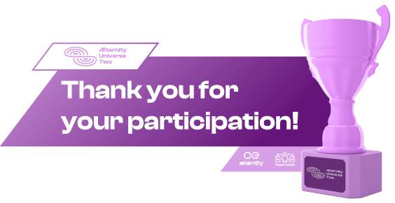

# Prizes

All prizes are paid in Æ coins.

| Type | Prize | Winner | Payout |
|---|---|---|---|
| **1st place** | **$15,000** | [GalacticWar](https://devpost.com/software/galacticwar-xdur2t) | [th_2dM3zSvDewX7cfSb8arnRXJKoH1Pxgd182up4fyeCWoUVpriv6](https://explorer.aeternity.io/transactions/th_2dM3zSvDewX7cfSb8arnRXJKoH1Pxgd182up4fyeCWoUVpriv6) |
| 2nd place | $8,000 | [Nuclearswap](https://devpost.com/software/nuclearswp) | [th_U5zRGTB1RxA52rZyn9yZjwdk5qvVhsKjN22C7XiCWxAg1KoGG](https://explorer.aeternity.io/transactions/th_U5zRGTB1RxA52rZyn9yZjwdk5qvVhsKjN22C7XiCWxAg1KoGG) |
| 3rd place | $5,000 | [DeMarketly](https://devpost.com/software/paydii-865dmb) | [th_ubVZff3bW22bfBttxzpS2ShQYCpRW9qs17vhcu5Xu4UH7BnJq](https://explorer.aeternity.io/transactions/th_ubVZff3bW22bfBttxzpS2ShQYCpRW9qs17vhcu5Xu4UH7BnJq) |
| Community Choice Award | $2,500 | [defi æternity](https://devpost.com/software/defi-aeternity) | [th_fYcdYDdQcV3K6FjY7CB3dPYuAa2w9M2jVQDcPcna7VZMMaoqf](https://explorer.aeternity.io/transactions/th_fYcdYDdQcV3K6FjY7CB3dPYuAa2w9M2jVQDcPcna7VZMMaoqf) |
| | | | |
| Total | $30,500 | | |

# Timeline

## General

| Date | Title | Details |
|---|---|---|
| 01.08.2022 | **Start of the Hæckathon** | Sign up, join the community, find a team, generate an idea & start hæcking! |
| 16./17.09.2022 | **Hæckathon Finale** | Update: Now **100% remote**, more infos in the [DevPost Update](https://universe-two-haeckathon.devpost.com/updates/23825-haeckation-finale-final-countdown-presentations-now-100-remote) |
| 18.09.2022 | **Submission Deadline** | Complete the submission form **BEFORE** 11:59 PM. |
| 19.09.2022 - 25.09.2022 | **Judging Period & Community Voting** | The judges will review all submissions and determine the winners. The community will vote on their favorite projects and decide which team wins the Community Choice Award. |
| 26.09.2022 | **Winner announcement** | We'll officially announce the winners of the Hæckathon. Good luck! |

## Presentations & Live-Demos

Following presentations have been organized. You can also access the whole playlist on YouTube:
- https://www.youtube.com/playlist?list=PLZTjth8D1qBcyoOxP2aeukgtwl6CKS_Ig

| Date | Time (CEST) | Title | Presenter | Links |
|---|---|---|---|---|
| Tue, 23.08.2022 | 06:00 PM | **Welcome & Introduction** | [@marc0olo](https://github.com/marc0olo) | [Video](https://www.youtube.com/watch?v=1izTRy_dr0I&list=PLZTjth8D1qBcyoOxP2aeukgtwl6CKS_Ig), [Slides](./slides/20220823-UniverseTwoHackathon-Welcome_Intro.pdf) |
| Wed, 24.08.2022 | 06:00 PM | **Code, test and deploy Smart Contracts using AEProject** | [@thepiwo](https://github.com/thepiwo) | [Video](https://www.youtube.com/watch?v=IbsRU2PhNoc&list=PLZTjth8D1qBcyoOxP2aeukgtwl6CKS_Ig), [Slides](./slides/20220824-UniverseTwoHackathon-AEproject.pdf) |
| Wed, 24.08.2022 | 06:45 PM | **Full power of Sophia with REPL** | [@radrow](https://github.com/radrow) | [Video](https://www.youtube.com/watch?v=YpRHHY24O4I&list=PLZTjth8D1qBcyoOxP2aeukgtwl6CKS_Ig) |
| Wed, 24.08.2022 | 07:30 PM | **Create Fungible Tokens in 3 easy steps using AEX-9** | [@thepiwo](https://github.com/thepiwo) | [Video](https://www.youtube.com/watch?v=-_NdKiRG_yk&list=PLZTjth8D1qBcyoOxP2aeukgtwl6CKS_Ig), [Slides](./slides/20220824-UniverseTwoHackathon-AEX-9.pdf) |
| Fr, 26.08.2022 | 06:00 PM | **Superhero DEX: How to add liquidity for your preferred token** | [@kenodressel](https://github.com/kenodressel) | [Video](https://www.youtube.com/watch?v=Gj_td7ssHug&list=PLZTjth8D1qBcyoOxP2aeukgtwl6CKS_Ig) |
| Fr, 26.08.2022 | 06:45 PM | **How to make an NFT on æternity blockchain using AEX-141** | [@marc0olo](https://github.com/marc0olo) | [Video](https://www.youtube.com/watch?v=vv_Wl93dEWo&list=PLZTjth8D1qBcyoOxP2aeukgtwl6CKS_Ig), [Slides](./slides/20220826-UniverseTwoHackathon-create-NFTs-with-AEX-141.pdf) |
| Fr, 26.08.2022 | 07:30 PM | **Create your dApp with our Web3 Starter-Kit** | [@ifaouibadi](https://github.com/ifaouibadi) | [Video](https://www.youtube.com/watch?v=3D1HLBCYXwE&list=PLZTjth8D1qBcyoOxP2aeukgtwl6CKS_Ig) |

# Questions?

Join our [Discord](https://discord.gg/55f8F2jZq4) server and get in touch with the developers!

# Thank you!
The Hæckathon was hosted via DevPost. You can explore all details here:
- https://universe-two-haeckathon.devpost.com

